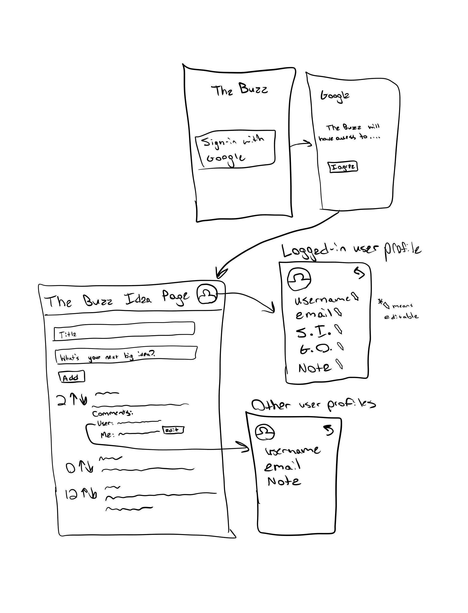
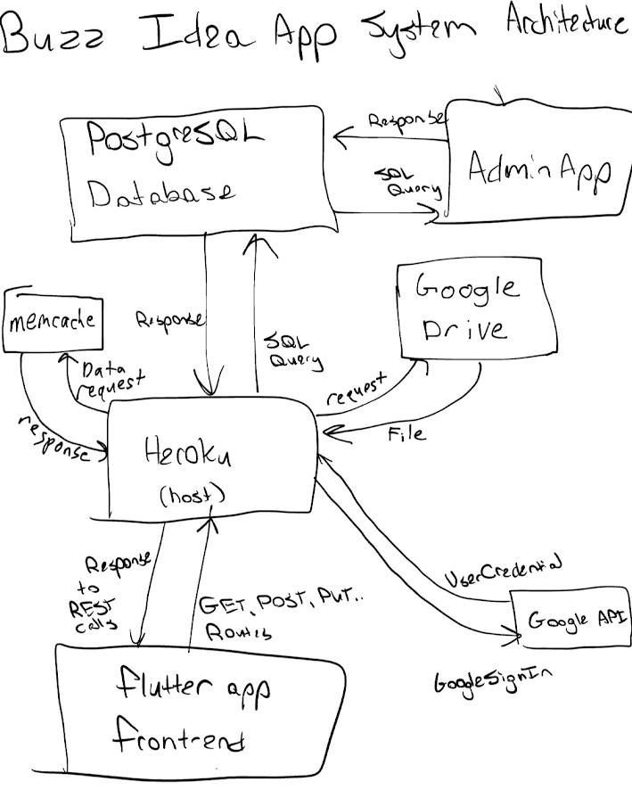
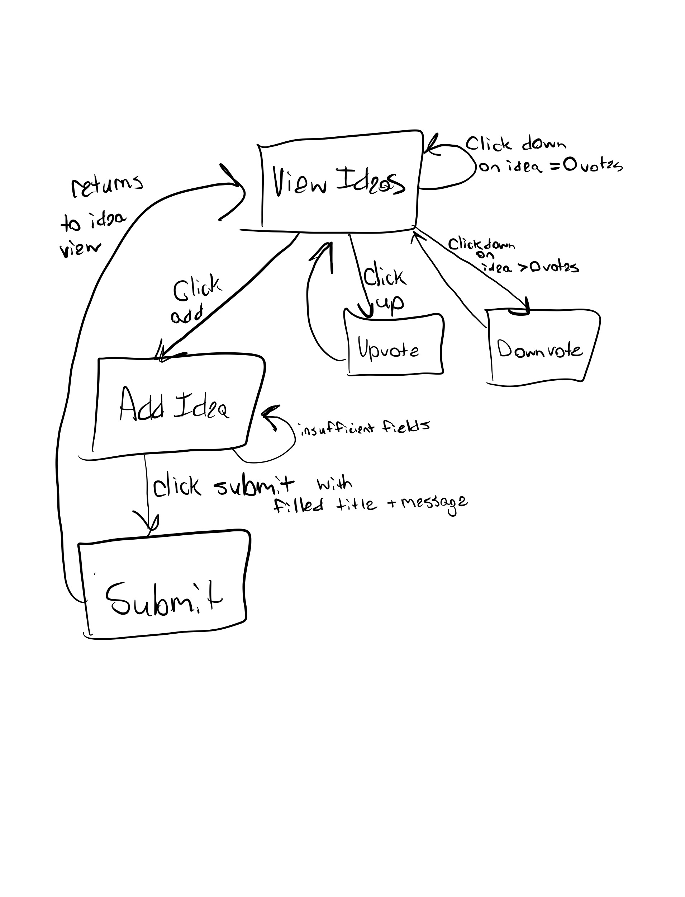
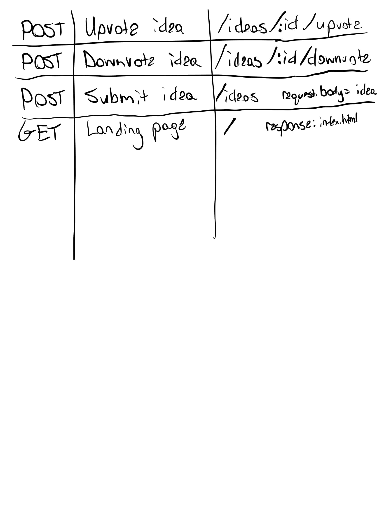
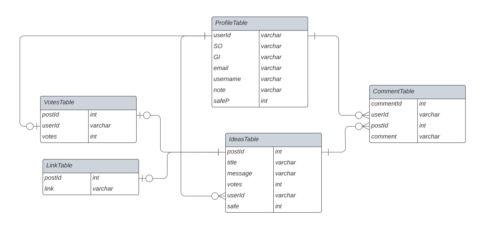

# **The Buzz**
## Authors
- Aarushi Singh
    - aas620
- Mattias Culbertson
    - mlc325
- Micah Worth
    - mjw324
- Yiannis Karamitros
    - yak224

## Description
Our goal  was to create an application to to post short ideas and have other employees like and remove the like from that idea. In backend, we were able to create a server that provided several routes through which a user can post new ideas and like ideas. Through admin, we were able to create a table and drop/delete a table. Lastly, through the front end, we were able to create a user interface to allow the users to see all the new ideas, create their own, and like or dislike an idea. 

## How to Build and Run
We will build and run the application by going to the respective branches names below and the following:
Backend: mvn package; mvn heroku:deploy
Frontend: F5

## Backend Learning
- made sure the name of the page is whispering-sands-78580
- data clips allow us to check the database from heroku

## Code Documentation
- [Admin Doc HTML](artifacts/Admin-Javadocs/index.html)
    - website: file:///C:/Users/Aarus/small-data-group-repo/artifacts/Admin-Javadocs/index-all.html
- [Backend Doc HTML](artifacts/Backend-JavaDoc/index.html)
    - website: file:///C:/Users/Aarus/small-data-group-repo/artifacts/Backend-JavaDoc/edu/lehigh/cse216/mlc325/backend/package-summary.html
- [Frontend Doc HTML](artifacts/Frontend-Javadocs/api/index.html)
    - to access: 
        - dart pub global activate dhttpd
        - dhttpd --path doc/api
# Project Design and Planning Artifacts

## User Stories
1. As an anonymous user
I want the ability to share ideas
So I can get my idea to other colleagues (automated)

2. As an anonymous user
I want to be able to up or downvote
So I can give feedback to other colleagues ideas (automated)

3. As an anonymous user
I want to be able to anonymously share my opinion
So I can give anonymous feedback to other colleagues ideas (automated)

4. As an administrator
I want to be able to create or delete tables
So that I can set up or clear the app (automated)

5. As an administrator
I want to be able to remove entries
So I can remove inappropriate ideas (automated)

6. As an anonymous user
I want to be able to view the amount of up and downvotes on an idea
So I can see what my colleagues think of the ideat (manual)

## Mock web/mobile user interface

## System drawing showing the major components and their location

### Drawing of the state machine for the anonymous user persona�s interaction with the application

## Listing of the routes, their purpose, and the format of any passed object

## Entity relationship diagram of the database table and fields

## Unit Tests
### Backend:
- Code actually updates or subtracts 1 for like or dislike
- Records can be added to database
- Connects to postgres

### Frontend:
- Add button on press -> goes to text field
- Submit button adds idea field onto list
- Upvote button adds to vote counter
- Downvote button subtracts from vote counter (votes > 1)
- Downvote button does not subtract from vote counter for no votes

### Admin:
- Test that database was created correctly
- Test that database was deleted correctly
- Test that rows were removed correctly

Trello invite link:
https://trello.com/invite/cse216mlcc325/08e8c14c1250d96b2bdec08825a8fc0b

