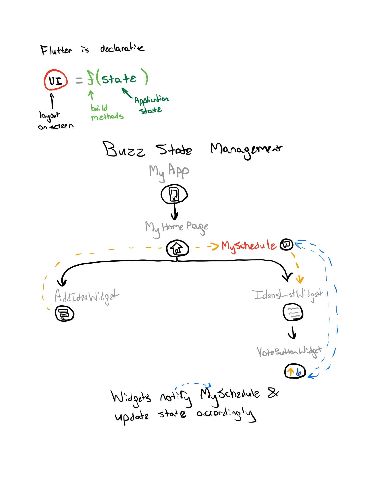
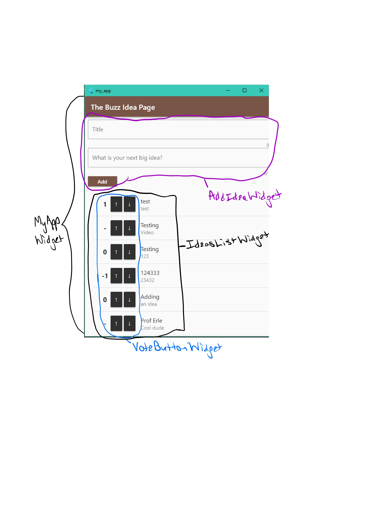
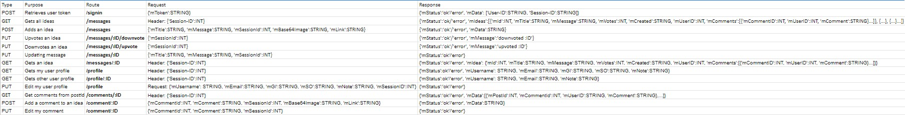

# **The Buzz**
## Authors
- Aarushi Singh
    - aas620
- Matthias Culbertson
    - mlc325
- Micah Worth
    - mjw324
- Yiannis Karamitros
    - yak224

## Description
Our goal  was to create an application to to post short ideas and have other employees like and remove the like from that idea. In backend, we were able to create a server that provided several routes through which a user can post new ideas and like ideas. Through admin, we were able to create a table and drop/delete a table. Lastly, through the front end, we were able to create a user interface to allow the users to see all the new ideas, create their own, and like or dislike an idea. 

## How to Build and Run
We will build and run the application by going to the respective branches names below and the following:
Backend: mvn package; mvn heroku:deploy
Frontend: F5

## Backend Learning
- made sure the name of the page is whispering-sands-78580
- data clips allow us to check the database from heroku

## Code Documentation
- [Admin Doc HTML](artifacts/Admin-Javadocs/index.html)
    - website: file:///C:/Users/Aarus/small-data-group-repo/artifacts/Admin-Javadocs/index-all.html
- [Backend Doc HTML](artifacts/Backend-JavaDoc/index.html)
    - website: file:///C:/Users/Aarus/small-data-group-repo/artifacts/Backend-JavaDoc/edu/lehigh/cse216/mlc325/backend/package-summary.html
- [Frontend Doc HTML](artifacts/Frontend-Javadocs/api/index.html)
    - to access: 
        - dart pub global activate dhttpd
        - dhttpd --path doc/api
# Project Design and Planning Artifacts

## User Stories
1. As an authenticated user
I want the ability to share ideas
So I can get my idea to other colleagues (automated)

2. As an authenticated user
I want to be able to up or downvote
So I can give feedback to other colleagues ideas (automated)

3. As an authenticated user
I want to be able to share my idea
So I can give my opinion (manual)

4. As an authenticated user
I want to be able to comment on ideas
So I can give feedback to other colleagues ideas (manual)

5. As an authenticated user
I want to be able to edit my comments
So I can revise any mistakes (manual)

6. As an authenticated user
I want to be able to create a profile
So my ideas can be associated with my profile (manual)

7. As an authenticated user
I want to view my profile
So I can see all attributes are correct (manual)

8. As an authenticated user
I want to be able to view the amount of up and downvotes on an idea
So I can see what my colleagues think of the idea (manual)

9. As an authenticated user
I want to be able to sign in with my google account
So I can access the buzz app (manual)

10. As an authenticated user
I want to be able to add file attachments to my posts
So I can communicate a wider variety of information (manual)

11. As an authenticated user
I want to be able to add file attachments to my comments
So I can communicate a wider variety of information (manual)

12. As an admin
I want to be able to create or delete tables
So that I can set up or clear the app (automated)

13. As an admin
I want to be able to remove entries
So I can remove inappropriate ideas (automated)

14. As an admin
I want to be able to associate comments with the respective user and idea
So I can manage comments (automated)

15. As an admin
I want to be able to remove attached content
So I can stay under storage quotas or remove inappropriate content (automated)

16. As an admin
I want to be able to view and sort attached files
So I can optimally manage the file storage quota (automated)

17. As an admin
I want to be able to perform admin responsibilities from within the app
So I do not need additional interfaces (manual)

## Mock Web/Mobile UI
[Artifacts-1](artifacts/Artifacts-1.jpg)

## System Architecture Diagram
[Artifacts-2](artifacts/Artifacts-2.jpg)

### State Machine of Authenticated User Interface
[Artifacts-3](artifacts/Artifacts-3.jpg)

## State Machine of Idea Functionality
[Artifacts-4](artifacts/Artifacts-4.jpg)

## ER Diagram
[Artifacts-5](artifacts/Artifacts-5.jpg)

## Flutter State and Widget Management 

## REST API Routes

## Unit Tests
### Backend:
- Code actually updates or subtracts 1 for like or dislike
- Records can be added to database
- Connects to postgres
- User with lehigh.edu google account passes authorization
- Make sure POST routes successfully add comments
- MemCachier stores and return correct values

### Frontend:
- Add button on press -> goes to text field
- Submit button adds idea field onto list
- Upvote button adds to vote counter
- Downvote button subtracts from vote counter (votes > 1)
- Downvote button does not subtract from vote counter for no votes
- Comment button adds comment on idea
- Edit profile buttons successfully change fields that were edited
- Added files are displayed properly

### Admin:
- Test that database was created correctly
- Test that database was deleted correctly
- Test that rows were removed correctly
- Test that list of files is correct

