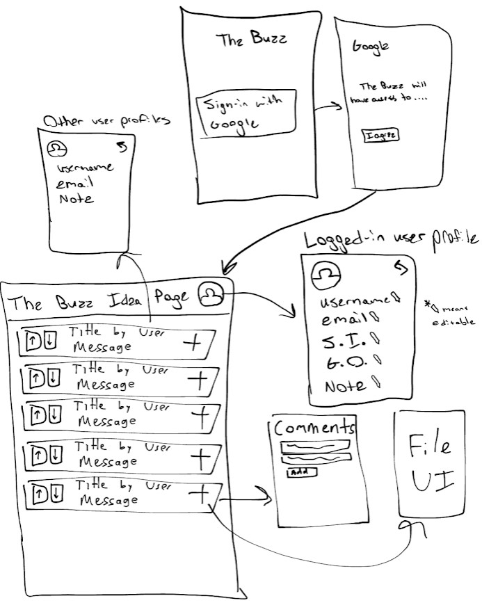
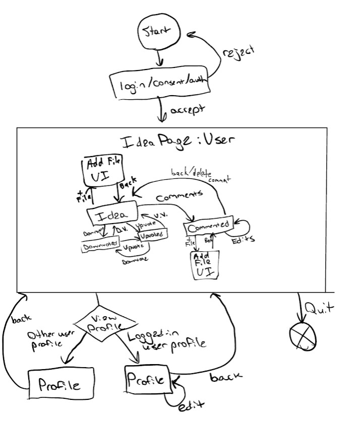
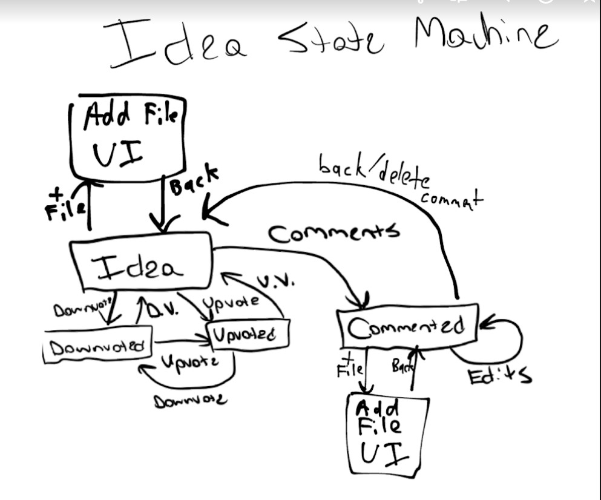
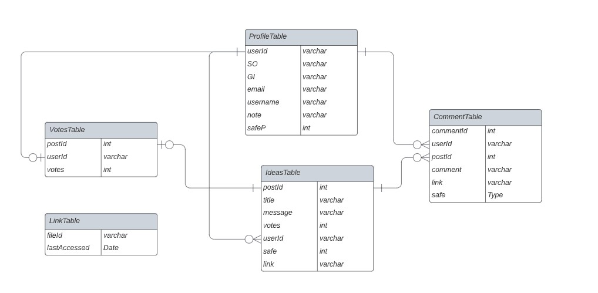

## authors
- Aarushi Singh
- Mattias Culbertson
- Micah Worth
- Yiannis Karamitros
## User Stories
1. As an anonymous user
I want the ability to share ideas
So I can get my idea to other colleagues (automated)

2. As an anonymous user
I want to be able to up or downvote
So I can give feedback to other colleagues’ ideas (automated)

3. As an anonymous user
I want to be able to anonymously share my opinion
So I can give anonymous feedback to other colleagues ideas (automated)

4. As an administrator
I want to be able to create or delete tables
So that I can set up or clear the app (automated)

5. As an administrator
I want to be able to remove entries
So I can remove inappropriate ideas (automated)

6. As an anonymous user
I want to be able to view the amount of up and downvotes on an idea
So I can see what my colleagues think of the ideat (manual)

## Mock web/mobile user interface

## System drawing showing the major components and their location

## Drawing of the state machine for the anonymous user persona’s interaction with the application

## Listing of the routes, their purpose, and the format of any passed object

## Entity relationship diagram of the database table and fields

Trello invite link:
https://trello.com/invite/cse216mlcc325/08e8c14c1250d96b2bdec08825a8fc0b

